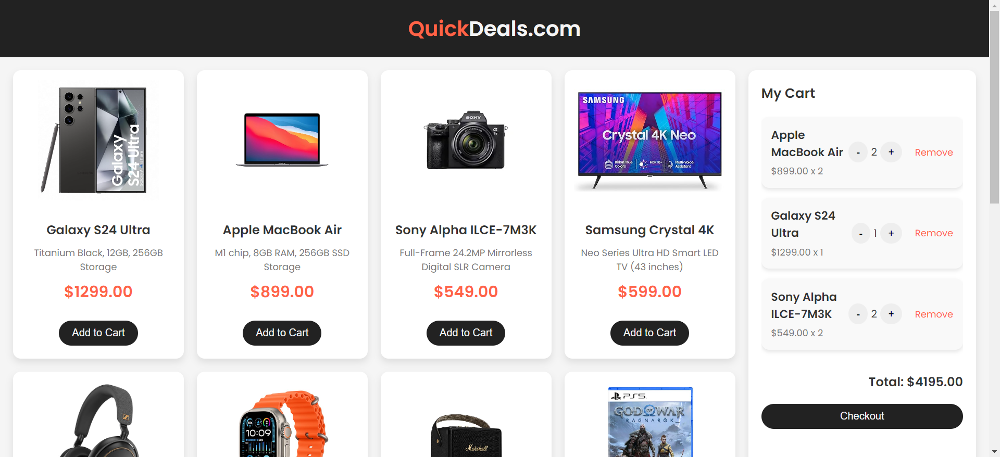
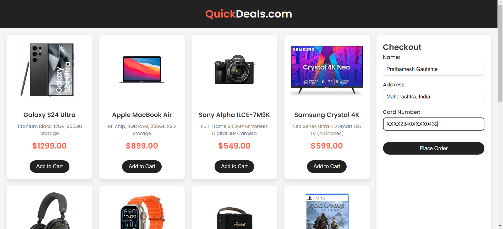
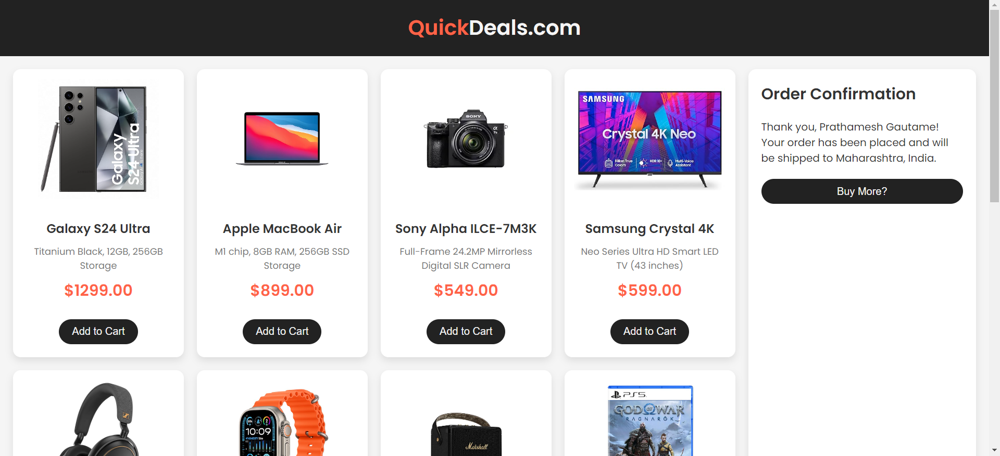

# mini-e-commerce-website

A simple and functional e-commerce website that showcases products, allows users to add items to a shopping cart, manage the cart, and simulate the checkout process.

## Table of Contents

- [Introduction](#introduction)
- [Features](#features)
- [Screenshots](#screenshots)

## Introduction

The **mini-e-commerce-website** is a web application designed to mimic the core functionalities of an e-commerce platform. Built with HTML, CSS, and JavaScript, this website allows users to browse a list of products, add them to a shopping cart, manage the cart items, and go through a simulated checkout process.

## Features

- **Dynamic Product Listing**: Utilizes a JSON file containing product data to dynamically generate a product listing grid on the website. Each product is displayed with details such as name, price, description, and an image.

- **Interactive Shopping Cart**: Includes an "Add to Cart" button on each product card. Users can add products to their shopping cart, which updates the cart section with the product's name, price, and quantity.

- **Cart Management**: Allows users to adjust the quantity of products in the cart. Features buttons to increase or decrease the quantity and a "Remove" button to delete items from the cart. The cart display updates accordingly.

- **Checkout Process Simulation**: Provides a checkout form for users to enter their name, address, and payment details. On form submission, the app simulates a checkout process and displays a confirmation message with the order details.

## Screenshots

  
_Display of the product listing grid and shopping cart section showing products added to the cart_

  
_Checkout form for entering user and payment information_

  
_Order confirmation message with the order details_
